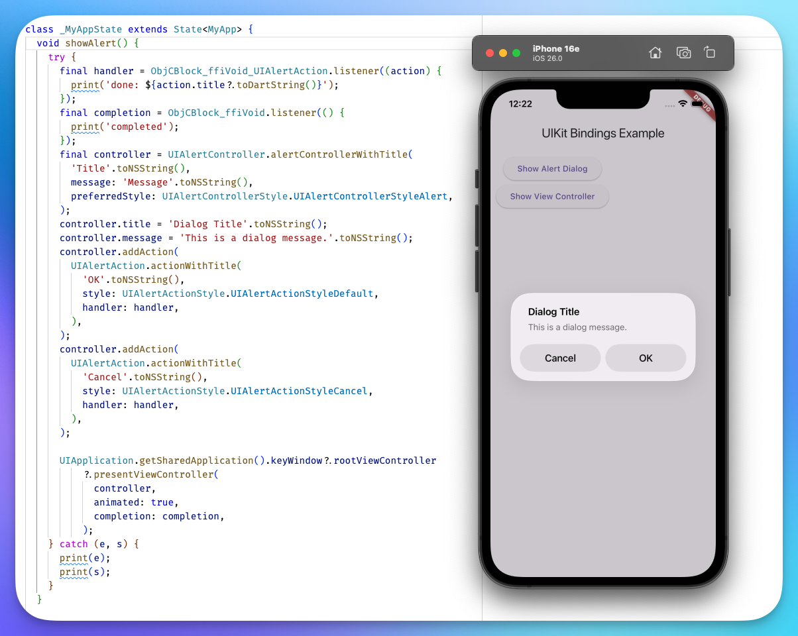

# uikit



## Regenerating bindings

This project uses Dart-API to use ffigen. To regenerate the bindings, run:

```bash
dart run tool/ffigen.dart
```

Known issues:

- classes like `UISwitch`, `UIScrollView` don't get default constructor, see https://github.com/dart-lang/native/issues/2655